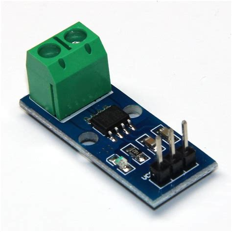

# Voron0_BatteryPower
 Make your voron even more reliable and more portable

[Disclaimer - read first](#wiring)

This mod allows you to run your voron up to 1-2h with batteries. It's also a great UPS for it.

The original PSU is now external, connected using XT60 plug. Now you can also power your printer with USB-C charger (12V and 20V).

The mod also includes space for an external RJ45 to usb adapter, form which you can connect your voron to pc via usb-c without connection to your home network.


## Gallery

<details><summary>photos</summary><p>


</p></details>

# Parts required
## Base battery power
- 6x 21700 li ion battery
- 2x 21700 x3 holder
- 6s BMS
  - Watch out fot BMS's that don't have voltage balancing!
- 150W Step up converter
    
- 400W step up cc/cv converter
    
- LM2596 step down converter
  
- MOSFET PWM module
  
- USB 20V PD trigger (prefferably one that senses the highest possible voltage from charger and supports PD as well as QC)
  
- USB C header (or USB A to USB C otg adapter)
- pair of XT60 connectors (one to screw to the case)
- cables that can hold at least 6A
- High current low voltage drop schottky diodes (at most 5)

## Power meter display (optional but recommended)

- current sensor (5A or higher)
  
- arduino Nano
- 0.96 inch OLED i2c display (design is made for the smaller design)
- 1:5 voltage divider
- SMD tact switch


# Hardware

## Preload `0` nuts for 1515 extrusions
- I made this design as easy to assemble as possible. No need to preload any nuts or modify existing voron hardware.

## Print everything with ASA / ABS
- it needs to be temperature resistant
- due to its size, I extended it in compensation of ABS shrinkage

## Insert inserts
- every hole that looks like it needs an insert, needs an insert

## bolt everything together
- bolt the whole thing together. You may use any length of bolts that fits, I made the design with ease to assemble in mind.
- Make sure you have a handful of `M3x6 BHCS` screws
- sometimes parts need to be assembled in order to fit. Assemble plastics first, then electronics.

## Wiring
- There's a slot for 2 `WAGO 221-415` connectors for batteries
- connect everything like on the schematic
  - 

- I created 2 custom boards:
  - one for creating soft-start for cc/cv boost converter, which also works as current limit switch (so on 12V in it's drawing 1.5A, on 20V it's drawing 3.25A)
  - one for communicating RPI with the power electronics (RPI knows when I flip the power switch, electronics turns off the printer when RPI shuts down) - so the switch shuts down the printer correctly, by executing `shutdown now` command
    
    These boards are mandatory for the system to work, but I created them by hand and I don't feel confident enough to share them with you. I'd love to hear if anyone knowing electronics (prefferably mostly designing of boost / buck converters) to collaborate and create one common board for the electronics instead of all the `Parts Required` section electronics. In that way it'll increase in power efficiency for sure, and be smaller and better to wire.


# Software

## Power display

- upload `PowerDisplay` code to an additional arduino nano
- calibrate its values so it measures voltage and current reliably

## Power switch

- Copy `PowerOff` into your voron home folder
- create a new system service:
  - `sudo nano /etc/systemd/system/PowerOff.service`
  - ```
    [UNIT]
    Description=Remote power off

    [Service]
    Type=simple
    WorkingDirectory=/home/pi/PowerOff
    ExecStart=/usr/bin/python3 -u main.py
    Restart=always

    [Install]
    WantedBy=multi-user.target
    ```
  - `sudo systemctl daemon-reload`
  - `sudo systemctl enable PowerOff.service`
  - `sudo systemctl start PowerOff.service`


